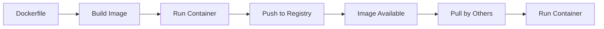

# 🐳 Docker: Comprehensive Overview

## 🧱 What is Docker?

Docker is a **containerization platform** that allows developers to **package applications with all their dependencies** into a standardized unit — called a **container** — to ensure that the application works consistently across different environments.

---

## 🚀 Why Use Docker?

### Consistency Across Environments

* A container includes **everything** needed to run: code, libraries, environment variables, etc.
* Ensures **“it works on my machine”** also works in production.

### Isolation

* Multiple containers can run **on the same server** without interfering with each other.
* Each container is **lightweight and isolated** from others.

### Scalability

* Applications in containers can be **deployed across multiple servers or nodes**.
* Great for **cloud environments** and **horizontal scaling**.

---

## 🔧 How Docker Works (Architecture)

```
Docker CLI <----> Docker REST API <----> Docker Daemon (dockerd)
```

* **Docker Daemon**: Core engine that manages containers, images, and networks.
* **Docker REST API**: Interface for communicating between CLI or other tools and the daemon.
* **Docker CLI**: Command-line interface to interact with Docker.

---

## 🧩 Docker Image Structure

A **Docker image** is a snapshot that contains everything needed to run a container:

1. **Base Image**: Starting point (e.g., `ubuntu`, `python`, `node`)
2. **Application Code**: Your own app files
3. **Dependencies**: Libraries, environment config, etc.
4. **Metadata**: Ports, volume info, author, etc.

---

## 🔄 Docker Image Lifecycle

1. **Creation** – Define image in a `Dockerfile`.
2. **Build** – Generate image using `docker build`.
3. **Storage** – Save locally or in a registry.
4. **Distribution** – Share via Docker Registry.
5. **Execution** – Run image as a container.

---

## 📄 Dockerfile

A `Dockerfile` is a **script of instructions** to build a Docker image, layer by layer.
Each command (like `FROM`, `COPY`, `RUN`, `CMD`) adds a **new layer** to the image.

---

## 📦 Docker Container

A **Docker container** is a **running instance** of a Docker image:

* It uses the image as a blueprint.
* It runs in isolation in the **host OS kernel**.
* You can start, stop, remove, and restart containers.

---

## 🗂️ Docker Registry & Docker Hub

### Docker Registry

A service for **storing and distributing Docker images**.

* **Tags**: Labels that identify versions of an image.
* **Repositories**: Collections of related Docker images.

### Types of Registries:

* **Public**: Docker Hub (most widely used)
* **Private**: Internal registries (e.g., for companies)
* **Third-Party**: Amazon ECR, GitHub Container Registry, etc.

### Benefits:

* **Version Control**
* **Collaboration**
* **Security**
* **Access Control**

---

## 🔁 Full Docker Lifecycle



1. Write `Dockerfile`
2. Build → Docker Image
3. Run → Docker Container
4. If stable, push to Registry (e.g., Docker Hub)
5. Others can pull and run

---

## ⚙️ Docker Desktop

Docker Desktop includes:

* **Docker Engine**:

  * **Daemon (`dockerd`)**
  * **CLI**
  * **REST API**

* **GUI**:

  * View and manage images, containers, volumes, and networks.
  * Internally calls Docker API.

---

## 🧠 Real-World Use Cases of Docker

1. **Microservices Architecture** – Each service runs in its own container.
2. **CI/CD Pipelines** – Consistent build/test environments.
3. **Cloud Migration** – Move apps between clouds without reconfiguring.
4. **Scalable Web Applications** – Load-balance containers across nodes.
5. **Testing and QA** – Spin up disposable environments quickly.
6. **Machine Learning / AI** – Package Jupyter notebooks, models, and dependencies.
7. **API Development & Deployment** – Wrap APIs with consistent runtime environments.